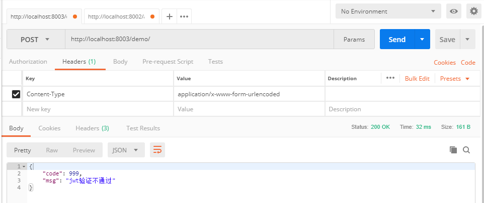
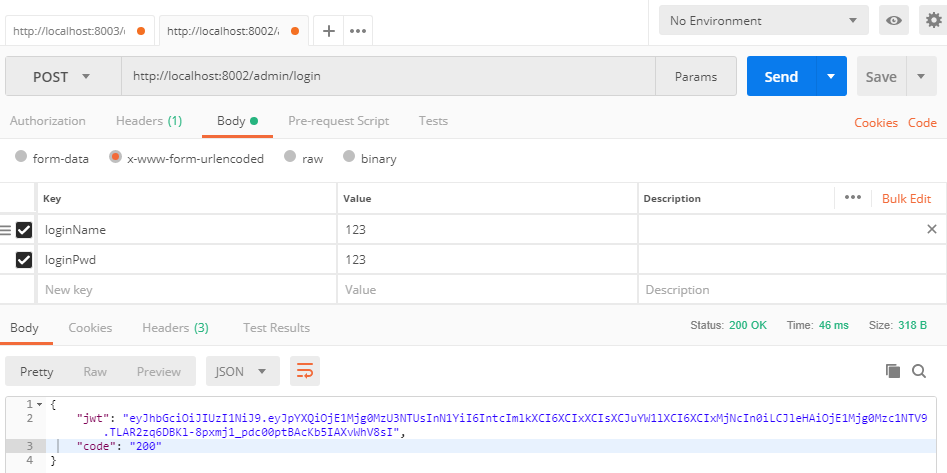
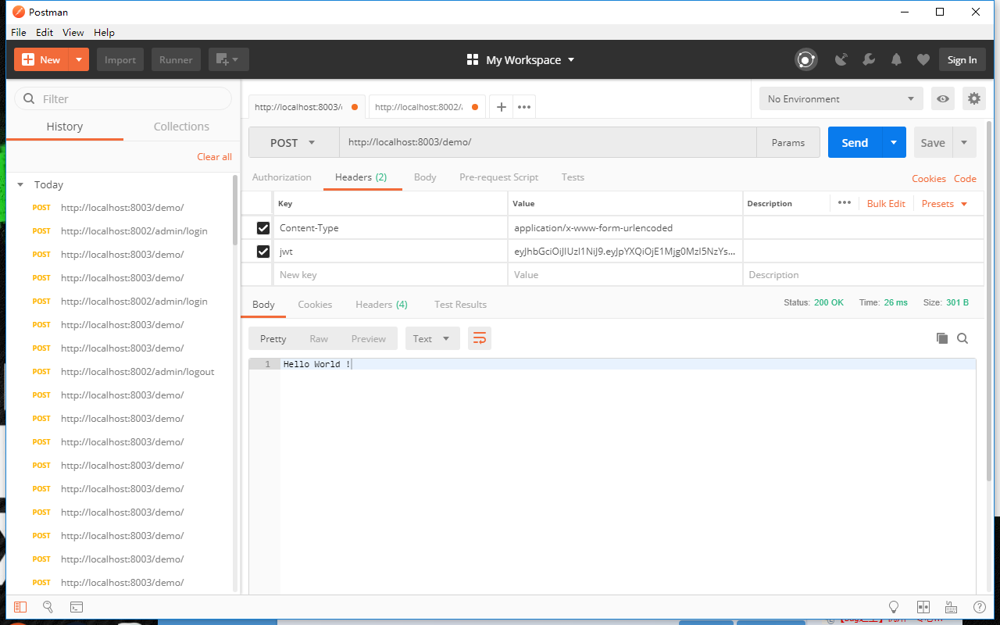
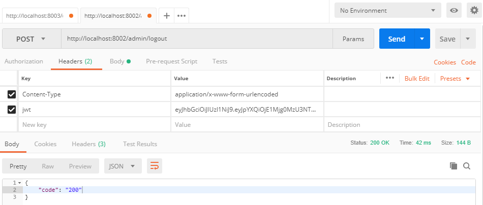
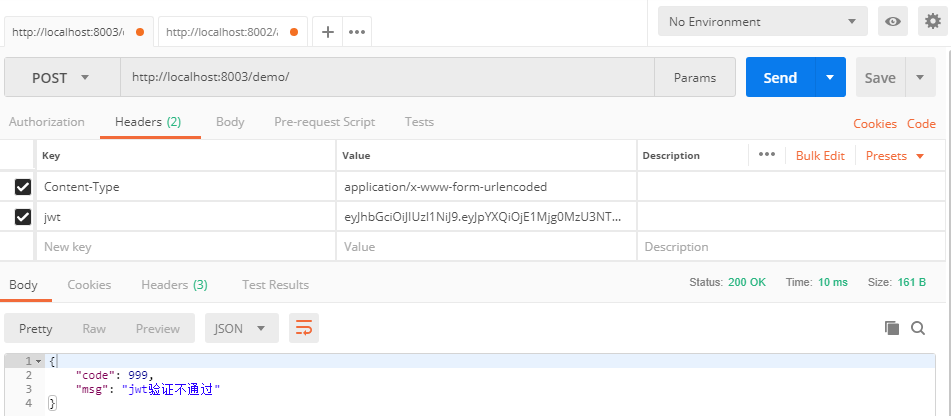

# sso-demo-springcloud

## 说明

   基于jwt（json web token）实现的单点登陆demo，所有访问为无状态访问，放问用户的身份信息可装载进jwt中，利用jwt明文不可修改的特性实现用户身份的识别。
使用redis记录用户的登陆状态，由于用户的身份信息存在于jwt串中，并且jwt存在有效期。所以用户在正常登陆使用时，服务器无需存贮jwt串，仅在用户进行注销操作时将用户的识别信息存储进redis中，将有效期设置为jwt有效期的剩余时间即可，节约服务器资源。

## 效果

1.未进行登陆操作时访问 localhost:8003/demo/ ，访问被拒绝

2.访问 localhost:8002/admin/login ，进行登陆操作返回token

3.将token放在http请求头部访问 localhost:8003/demo/ ，访问通过返回 Hello World !

4.将token放在http请求头部访问 localhost:8002/admin/logout ，进行注销

5.将token放在http请求头部访问 localhost:8003/demo/ ，由于已经注销，访问被拒绝

